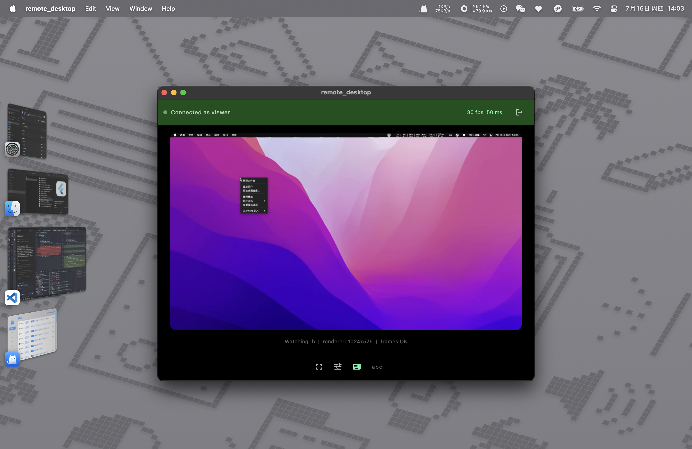
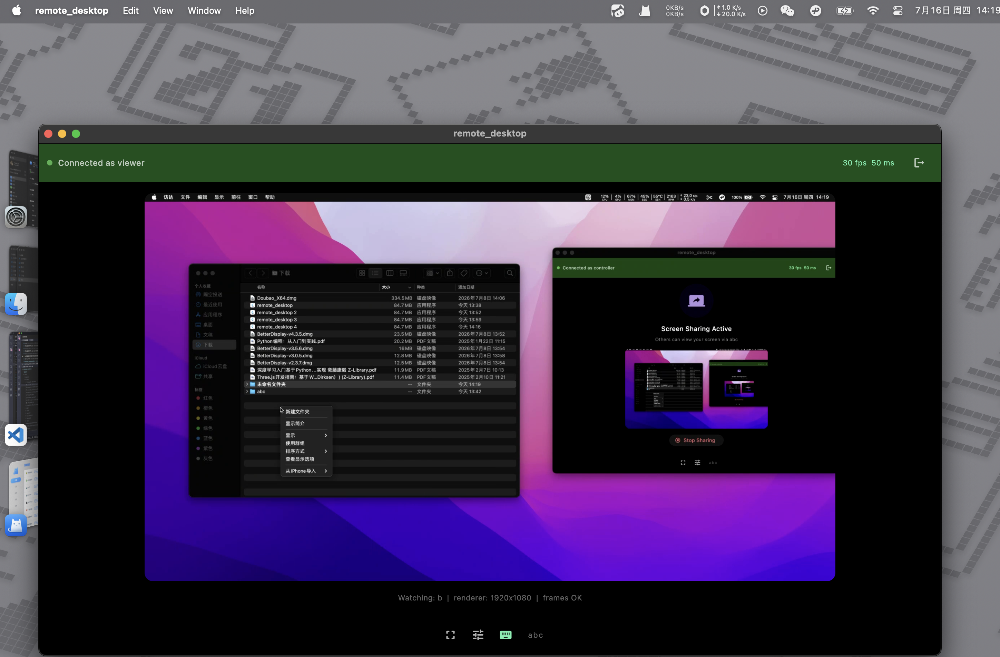

# Remote Desktop System

> A remote desktop control system built with Flutter Desktop + WebRTC (peer-to-peer) + Node.js.
> A personal project exploring architecture design, tech selection, and rapid development.

## Architecture

```
Controller (Flutter) ──WebRTC Media (P2P)──► Viewer (Flutter)
        │                                      │
        └──── WebSocket Signaling / Control ──┘
                  (Server relays only)
```

- **Media**: WebRTC peer-to-peer — the controller and viewer connect directly (1:1); no media server in the path
- **Signaling / Control**: A lightweight WebSocket server relays SDP/ICE and mouse/keyboard events; it does **not** route media
- **Auth**: JWT with room-scoped tokens

## Quick Start

```bash
# Server
cd server
npm install
cp .env.example .env
npm run dev

# Client (Controller)
cd client
flutter pub get
flutter run -d macos

# Client (Viewer - second window)
flutter run -d macos --dart-define=MODE=viewer
```

See `docs/SETUP.md` for detailed environment setup instructions.

## Screenshots

> 以下为 Controller / Viewer 双端联调的真实运行效果。

**Viewer 端（远程操控中）**




## Documentation

- [`docs/ARCHITECTURE.md`](docs/ARCHITECTURE.md) — System architecture, data flow, module design
- [`docs/TRADEOFFS.md`](docs/TRADEOFFS.md) — Tech selection tradeoffs and design rationale
- [`docs/SETUP.md`](docs/SETUP.md) — Environment setup guide

## Project Structure

```
remote-desktop/
├── client/               # Flutter Desktop
│   ├── lib/
│   │   ├── main.dart
│   │   ├── screens/
│   │   │   ├── connect_screen.dart    # Login/join page
│   │   │   └── control_screen.dart    # Main view (HUD: FPS/latency/packets)
│   │   ├── webrtc/
│   │   │   ├── peer_manager.dart      # WebRTC connection / stats
│   │   │   ├── screen_capture.dart    # Screen capture (ScreenCaptureKit / getDisplayMedia)
│   │   │   └── screen_share_controller.dart # Capture orchestration (controller side)
│   │   ├── signal/
│   │   │   ├── signal_client.dart     # WebSocket client (hand-rolled, auto-reconnect)
│   │   │   └── protocol.dart          # Shared SignalType / SignalMessage
│   │   ├── input/
│   │   │   └── input_controller.dart  # Remote input replay (controller side)
│   │   ├── utils/
│   │   │   └── resolution.dart        # Stride-safe resolution helpers
│   │   └── models/
│   │       ├── config.dart            # App config (Provider)
│   │       ├── room.dart              # Room model
│   │       ├── peer.dart              # Peer model
│   │       └── connection_manager.dart # Core orchestrator (facade)
│   ├── pubspec.yaml
│   └── analysis_options.yaml
│
├── server/               # Node.js signaling relay (no media server)
│   ├── src/
│   │   ├── index.js               # Entry point (JWT issuer)
│   │   ├── signal-server.js       # WebSocket signaling + control relay
│   │   ├── auth.js                # JWT generate/verify
│   │   └── utils/
│   │       ├── config.js          # Env config loader
│   │       └── logger.js          # Pino logger
│   ├── package.json
│   └── .env.example
│
└── docs/
    ├── ARCHITECTURE.md
    └── SETUP.md
```

## Key Design Decisions

| Decision | Choice | Rationale |
|----------|--------|-----------|
| Client | Flutter Desktop | Cross-platform, fast iteration with hot reload |
| Server | Node.js | Signaling/control relay; leverages existing frontend skills |
| Media | WebRTC P2P | 1:1 direct peer connection — no media server to deploy or scale |
| Codec | VP8 | Patent-free, hardware encoding on modern CPUs |
| Signaling | WebSocket | Simple, debuggable, low overhead for control |
| Auth | JWT | Stateless, room-scoped, easy to distribute |

## Performance Targets

| Metric | Target |
|--------|--------|
| LAN latency | < 200ms |
| WAN latency | < 500ms |
| Frame rate | 30fps @ 1080p |
| Control latency | < 10ms |
| Controller CPU | < 15% |

## License

MIT
